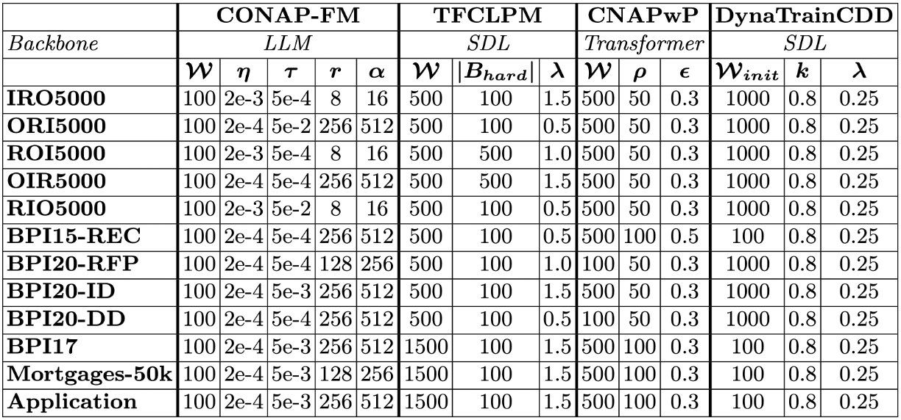

# COMPASS: Continual Online Foundation Model-based Process Prediction with Adaptive SubSpaces

**COMPASS** is a framework for online continual next activity prediction using Foundation Models (FMs). It addresses the cold-start problem and catastrophic forgetting that affect existing Predictive Process Monitoring (PPM) approaches by combining parameter-efficient fine-tuning with unsupervised drift detection and gradient-based knowledge consolidation — without requiring explicit task boundaries.

> **Paper:** *Online Continual Fine-Tuning of Foundation Models for Process Prediction* — submitted to ECML-PKDD 2025 Workshop on Scalable Continual Learning.

---

## 📁 Repository Structure

```text
COMPASS/
│
├── Data/                        # Raw event logs (.csv)
├── Methods/
│   └── COMPASS/
│       ├── run.py               # Entry point — CLI and experiment orchestration
│       ├── engine.py            # Streaming loop, drift detection, training
│       └── keeplora_handler.py  # Subspace management and LoRA reinitialization
├── Utils/
│   ├── preprocess.py            # Event log parsing and sequence extraction
│   └── metrics.py               # Accuracy, F1, and per-event logging
├── runs/                        # Output directory for results and CSVs
├── requirements.txt
└── README.md
```

---

## ⚙️ Installation

```bash
python -m venv venv
source venv/bin/activate
pip install -r requirements.txt
```

Requires Python ≥ 3.10 and a CUDA-capable GPU. Experiments were run on NVIDIA Tesla V100 (16 GB).

---

## 📊 Data Preparation

Place raw event logs (`.csv` format) in the `Data/` directory. Preprocessing, timestamp formatting, and prefix sequence extraction are handled automatically by `Utils/preprocess.py`. Preprocessed objects are cached as `.pkl` files under `Preprocessed/` to speed up repeated runs.

---

## How to Run?

### Basic run (task-free, Tiny-LLM)

```bash
python -m Methods.COMPASS.run \
    --dataset Data/BPIC2015_Recurrent.csv \
    --model-name arnir0/Tiny-LLM \
    --window-size 100 \
    --seed 42
```

### Task-aware variant (oracle drift boundaries)

```bash
python -m Methods.COMPASS.run \
    --dataset Data/BPIC2015_Recurrent.csv \
    --model-name distilbert/distilgpt2 \
    --oracle-drift \
    --seed 42
```

### Reproduce benchmark results (SLURM)

```bash
sbatch run_benchmark.sh COMPASS Data/ORI5000.csv
```

---

## Hyperparameters

Hyperparameters were tuned on the first 15% of each event log (validation split). The remaining 85% is used for online evaluation.

### COMPASS search space

| Parameter | Values |
|---|---|
| Window size (*W*) | {100, 500, 1000} |
| Learning rate (*η*) | {2e-3, 2e-4, 2e-5} |
| Variance threshold (*τ*) | {5e-2, 5e-3, 5e-4} |
| LoRA rank (*r*) | {8, 64, 256, 512} |
| LoRA alpha (*α*) | {16, 128, 512, 1024} |

### Optimal hyperparameters for each method per dataset 



All runs use *W* = 100, energy thresholds *ϵ*ᵥᵥ = 0.75, *ϵ*_f = 0.95, and max subspace rank = 64.

---

## 📊 Results
