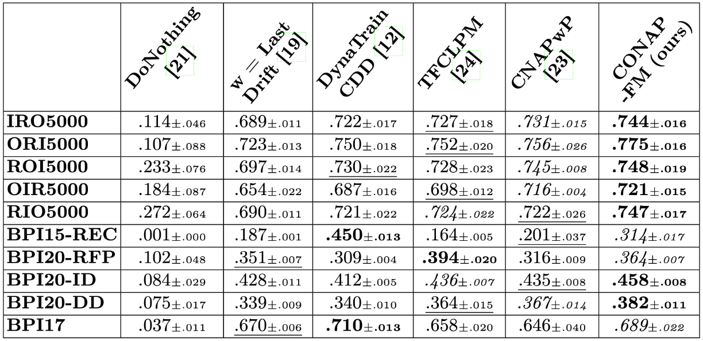

# CONAP-FM: Continual Online Next Activity Prediction with Foundation Models 🚀

## Hyperparameters

### Hyperparameter Search Space
* **Window Size ($\mathcal{W}$):** {100, 500, 1000, 1500} 
* **Learning Rate ($\eta$):** {2e-3, 2e-4, 2e-5} 
* **Variance Threshold ($\tau$):** {5e-2, 5e-3, 5e-4} 
* **LoRA Rank ($r$):** {8, 64, 128, 256} 
* **LoRA Alpha ($\alpha$):** {16, 128, 256, 512} 
* **Hard Buffer Size ($|B_{hard}|$):** {100, 300, 500} 
* **Regularization ($\lambda$):** {0.5, 1.0, 1.5} 
* **Buffer Size ($\rho$):** {50, 100, 200} 
* **Correlation Threshold ($\epsilon$):** {0.3, 0.5, 0.7} 
* **Weibull Shape ($W_k$):** {0.6, 0.8, 1.0}
* **Weibull Scale ($W_\lambda$):** {0.25, 0.50, 0.75} 

## Macro F1-Scores 

